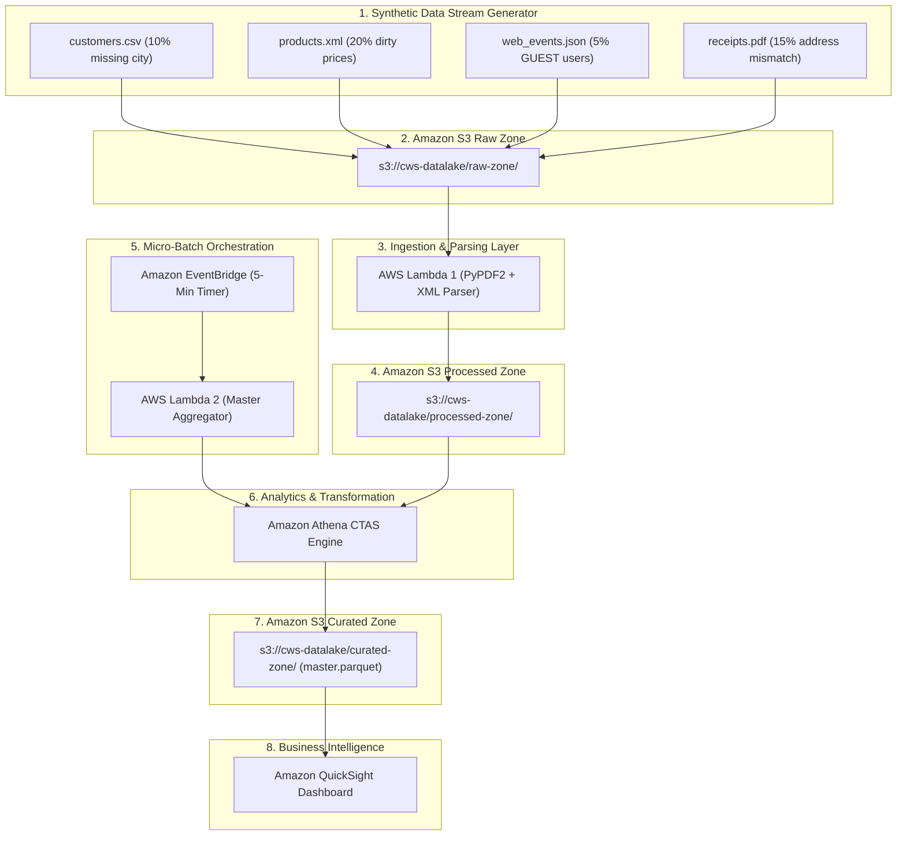
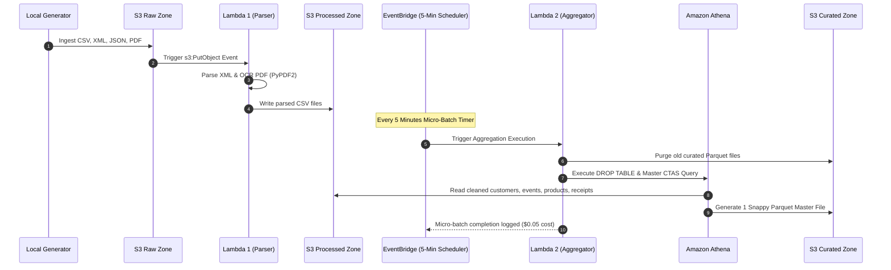
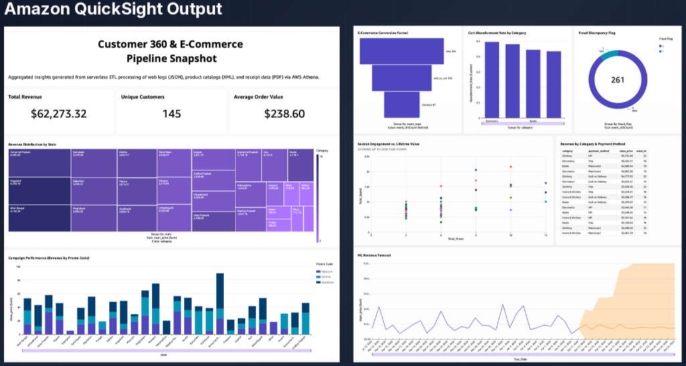

<div align="center">

# ⚡ Enterprise Serverless Data Lake for E-Commerce Analytics

### *100% Automated, Micro-Batch AWS ETL Pipeline & Analytics Engine*

[](https://aws.amazon.com/lambda/)
[](https://aws.amazon.com/s3/)
[](https://aws.amazon.com/athena/)
[](https://aws.amazon.com/eventbridge/)
[](https://www.python.org/)
[](https://parquet.apache.org/)

</div>

---

## 🎯 Executive Summary & Performance Highlights

Modern e-commerce enterprises face severe **"Data Silo"** challenges caused by fragmented data scattered across static databases, clickstream web logs, vendor catalogs, and unstructured PDF invoices. 

This project engineers a **100% automated, serverless ETL pipeline on AWS** that ingests multi-format chaotic data streams, resolves race conditions, sanitizes dirty data anomalies, and outputs an optimized Snappy-compressed Parquet dataset ready for executive BI dashboards in Amazon QuickSight.

| Metric | Benchmark Result | Significance |
| :--- | :--- | :--- |
| 📉 **Storage Reduction** | **92% Compression** (218 KB ➔ 17.3 KB) | Massive S3 cost saving & faster query scans |
| ⏱ **Ingestion Cadence** | **5-Minute Micro-Batch** | Eliminates race conditions & guarantees 1 master file |
| 💰 **Pipeline Cost** | **~$0.05 / Batch** | Highly cost-effective serverless execution |
| 🛠 **Automation Level** | **100% Zero-Touch** | Hands-off EventBridge cloud scheduling |

---

## 📐 System Architecture


### End-to-End Data Flow



---

## 🔄 Concurrency Resolution: Event-Driven vs Micro-Batch

> [!IMPORTANT]
> **Why Re-Architect Ingestion?**
> Pure event-driven triggers on individual file uploads create **"Check-Then-Act" race conditions**, causing multiple concurrent Lambda executions to attempt partial table writes and generate thousands of fragmented files.
>
> **The Micro-Batch Solution**:
> Decoupling parsing (Lambda 1) from aggregation (Lambda 2) via a **5-minute EventBridge cron scheduler** guarantees that all multi-format files in a batch arrive completely before a single deterministic CTAS query produces **exactly one master Parquet file**.



---

## 🧹 Engineered Data Anomalies & Transformation Matrix

| Data Source | Format | Engineered Anomaly | Processing Engine | Transformation & Solution |
| :--- | :--- | :--- | :--- | :--- |
| **`customers.csv`** | Structured Demographics | **~10% Missing City Values** | Athena SQL | `COALESCE(NULLIF(c.city, ''), 'Unknown City')` |
| **`products.xml`** | Semi-Structured Catalog | **~20% Prices with `$` Symbol** | Lambda 1 + Athena SQL | `.replace('$', '')` & `CAST(p.price AS DOUBLE)` |
| **`web_events.json`** | Real-Time Clickstream | **~5% Orphaned `GUEST` Users** | Athena SQL | `WHERE e.user_id != 'GUEST'` |
| **`receipts.pdf`** | Unstructured Invoices | **~15% Shipping != Billing Address** | Lambda 1 + Athena SQL | `CASE WHEN shipping != billing THEN 1 ELSE 0 END as fraud_flag` |

---

## 💻 Master Athena SQL Transformation Query

> [!NOTE]
> The Athena query executes inside Lambda 2 every 5 minutes. It combines 4 multi-format data sources, handles null imputation, casts dirty prices, filters guest traffic, and outputs Snappy-compressed Parquet.

```sql
CREATE TABLE ecommerce_datalake_db.ecommerce_analytics_master
WITH (
    format = 'PARQUET',
    parquet_compression = 'SNAPPY',
    external_location = 's3://cws-ecommerce-datalake-sd-9921/curated-zone/'
) AS
SELECT
    e.event_id,
    e.timestamp AS event_timestamp,
    e.user_id,
    COALESCE(NULLIF(c.full_name, ''), 'Unknown Customer') AS customer_name,
    c.age AS customer_age,
    
    -- 1. Category Imputation for Dirty CSV Data (~10% missing city)
    COALESCE(NULLIF(c.city, ''), 'Unknown City') AS customer_city,
    
    c.state AS customer_state,
    c.shipping_address,
    p.product_id,
    p.category AS product_category,
    
    -- 2. Strict Type Casting for Cleaned XML Prices
    CAST(p.price AS DOUBLE) AS product_price,
    
    e.event_type,
    r.order_id,
    r.payment_method,
    r.promo_code,
    r.billing_address,
    
    -- 3. Fraud Risk Flag Feature Engineering (~15% PDF address mismatches)
    CASE 
        WHEN c.shipping_address != r.billing_address THEN 1 
        ELSE 0 
    END AS fraud_flag

FROM processed_zone.events e
LEFT JOIN processed_zone.customers c ON e.user_id = c.user_id
LEFT JOIN processed_zone.products p ON e.product_id = p.product_id
LEFT JOIN processed_zone.receipts r ON e.user_id = r.customer_id AND e.product_id = r.product_id

-- 4. Orphaned Record Filtering (~5% guest users in clickstream)
WHERE e.user_id != 'GUEST';
```

---

## 📊 Storage Optimization & Compression Analysis

```
Raw Ingested Batch (CSV + JSON + XML + PDF):  [====================] 218.0 KB (100%)
Curated Parquet Output (Snappy Compressed):    [==] 17.3 KB (8%)
```

> [!TIP]
> Transitioning to Snappy-compressed Apache Parquet yielded a **92% storage reduction**, cutting Amazon S3 storage costs and reducing Athena scan costs down to **$0.05 per batch execution**.

---

## 📈 Business Intelligence Dashboard (Amazon QuickSight)



### Analytics Highlights & Visualizations
* **Customer 360 Snapshot**: Real-time KPIs tracking **Total Revenue ($62.27K)**, **Unique Customers (145)**, and **Average Order Value ($238.60)**.
* **Geographic Distribution**: Heatmap visualization of revenue distribution across Indian states.
* **Conversion & Abandonment**: Funnel tracking product view to checkout progression alongside cart abandonment rate breakdowns by product category.
* **Fraud Risk Detection**: Automated visual flagging of transactions where billing address mismatches shipping address (~15% anomaly rate).
* **Payment & Promo Insights**: Dynamic matrix analyzing category sales by payment method (UPI, Visa, MasterCard, COD) and promotional campaign performance (`FREESHIP`, `SAVE10`, `WINTER20`).
* **Predictive Forecasting & LTV**: Machine Learning model forecasting future revenue trends alongside session engagement vs. customer lifetime value analysis.

---

## 📁 Repository Structure

```
CWS_Ecommerce_Project/
├── .gitignore                          # Excludes build packages & environment configs
├── README.md                           # Master repository documentation
├── requirements.txt                    # Project dependencies
├── project flow chart.jpg              # High-level architecture visual asset
├── quicksight_dashboard.png            # Amazon QuickSight executive dashboard screenshot
├── Batch/                              # Micro-batch synthetic data storage
│   ├── customers/                      # Raw customers CSV batches
│   ├── events/                         # Raw clickstream JSON batches
│   ├── products/                       # Raw catalog XML batches
│   └── receipts/                       # Raw PDF invoice receipts
├── docs/
│   └── architecture_brief.md           # Comprehensive technical specification document
└── src/
    ├── athena/
    │   └── master_ctas_transformation.sql # Production Athena CTAS query template
    ├── generator/
    │   └── dataset_generator.py        # Multi-format dirty synthetic data generator
    ├── lambda_aggregator/
    │   └── lambda_function.py          # Lambda 2: 5-min EventBridge micro-batch handler
    └── lambda_parser/
        ├── lambda_function.py          # Lambda 1: S3 PutObject XML flattener & PDF OCR parser
        └── build_package.py            # Packaging script for PyPDF2 Lambda deployment zip
```

---

## 🚀 Deployment & Usage Guide

### 1. Installation & Environment Setup
```bash
# Clone the repository
git clone https://github.com/BhavyaGoyal-170/serverless-ecommerce-datalake.git
cd serverless-ecommerce-datalake

# Install local dependencies
pip install -r requirements.txt
```

### 2. Build AWS Lambda Deployment Zip
AWS Lambda's standard Python runtime does not include third-party libraries like `PyPDF2`. Run the included build script to package `PyPDF2` into the deployment package:

```bash
python src/lambda_parser/build_package.py
```
> **Output**: Generates `dist/lambda_parser_deployment.zip` (~700 KB) ready for direct upload to AWS Lambda 1.

### 3. Generate Synthetic Data Batches
```bash
# Generate Batch 1
python src/generator/dataset_generator.py 1
```

---

## 👤 Author & Credits

- **Author**: Bhavya (23/IT/042)
- **Project Title**: Enterprise Serverless Data Lake for E-Commerce Analytics
- **Timeline**: June 2026 – Present
